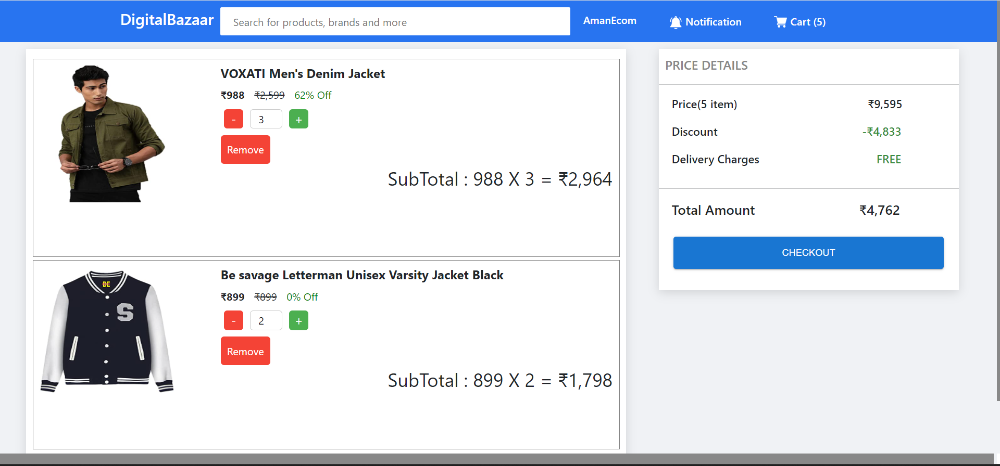
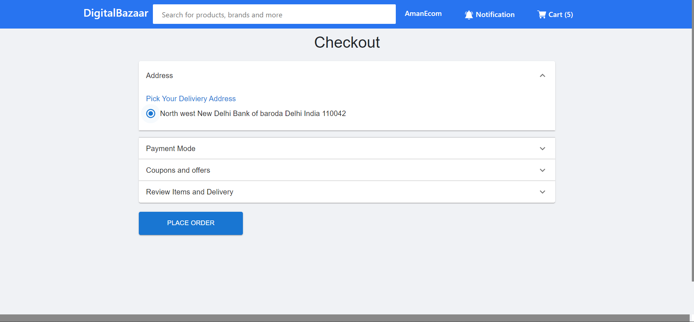

# Digital Bazaar

Digital Bazaar is an ecommerce website where users can register, search for products, add items to their carts, increment or decrement cart item quantity, and checkout their orders.





## Tech Stack

- Backend: Python, Django, Django Rest Framework, SQLite
- Frontend: JavaScript, Material-UI, React.js, Redux Toolkit

## Features

- User Registration: Users can create an account to access the website's features.
- Product Search: Users can search for products using keywords.
- Shopping Cart: Users can add items to their cart, view the items, and update their quantities.
- Order Checkout: Users can proceed to checkout and place their orders.

## Installation

1. Clone the repository:

```shell
git clone https://github.com/your-username/digital-bazaar.git

```

2. Navigate to project:

```shell
cd digital-bazaar
```

3. Install packages:

```shell
pip install -r requirements.txt
```

## Usage

- Create an account by clicking on the "Sign Up" button.
- Use the search bar to find products of interest.
- Click on a product to view its details.
- Add desired items to the shopping cart by clicking the "Add to Cart" button.
- Access the shopping cart by clicking on the cart icon in the header.
- Update the quantity of items in the cart by clicking the "+" and "-" buttons.
- Proceed to checkout and place your order.
